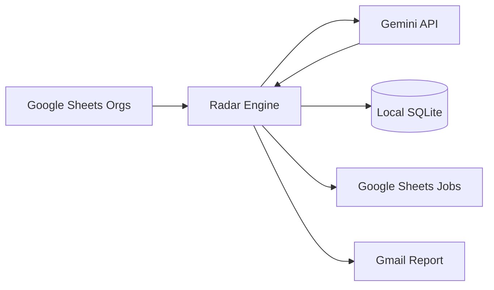

# Impact Finance Job Radar

A low-cost, low-noise, and traceable job radar system for the Impact Finance sector. Built with Python and Gemini API, it automatically scans job postings, syncs results to Google Sheets, and pushes high-match alerts to Gmail.

## 🚀 Key Features

- 🔍 **Multi-Source Scraping**: Supports scanning via Google Sheets organization lists or direct career site URLs.
- 🤖 **AI-Powered Evaluation**: Utilizes `gemini-3-flash-preview` for information extraction and "Fit Score" calculation.
- 📊 **Cloud Sync**: Automatically appends new job sightings to a Google Sheets "Job Results" tab.
- 📧 **Smart Notifications**: Sends professional HTML weekly reports via Gmail API for "Apply Now" recommendations.
- 💾 **Local Audit Trail**: Persistent SQLite database for tracking `job_postings`, `push_log`, and `usage_log`.
- ⚡ **Quota Optimized**: Content hashing and Dry-run mode to minimize unnecessary LLM API calls.

## 🛠️ Quick Start

### 1. Installation
```bash
pip install -r requirements.txt
```

### 2. Configuration
1. `cp .env.example .env`
2. Fill in `GEMINI_API_KEY` and `GOOGLE_SHEET_ID` in `.env`.
3. Place your Google Cloud `credentials.json` in the `config/` directory.

### 3. Initialization
```bash
# Initialize the local SQLite database
python scripts/init_db.py

# (Optional) Seed initial data
python scripts/seed_orgs.py
```

### 4. Running the Radar
```bash
# Test run with a limit of 5 organizations
python scripts/run_radar.py --limit 5

# Full run with Gmail report notification
python scripts/run_radar.py --send-email
```

### 5. Automation (macOS)
```bash
chmod +x scripts/setup_automation.sh
./scripts/setup_automation.sh
```

## 🔐 Security & Privacy

The `.gitignore` is pre-configured to ensure sensitive data is **never** committed to your repository:
- `.env` (Private API Keys)
- `config/credentials.json` & `config/token.json` (OAuth Credentials)
- `data/*.db` (Local data/cache)
- `logs/` (Rotation logs)

## 📊 Data Workflow


